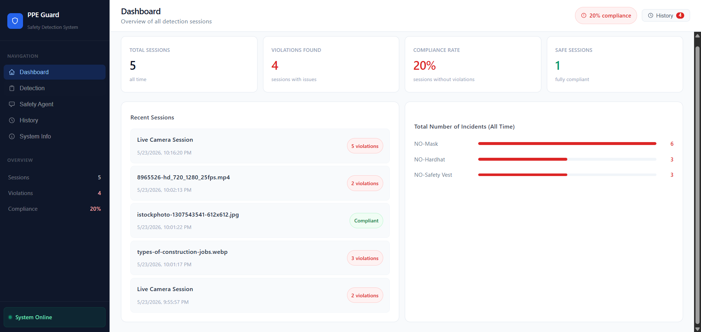
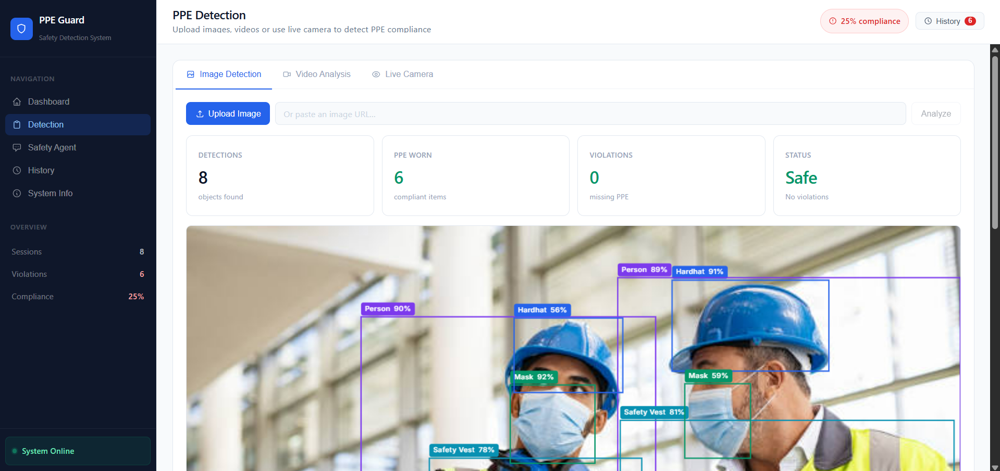
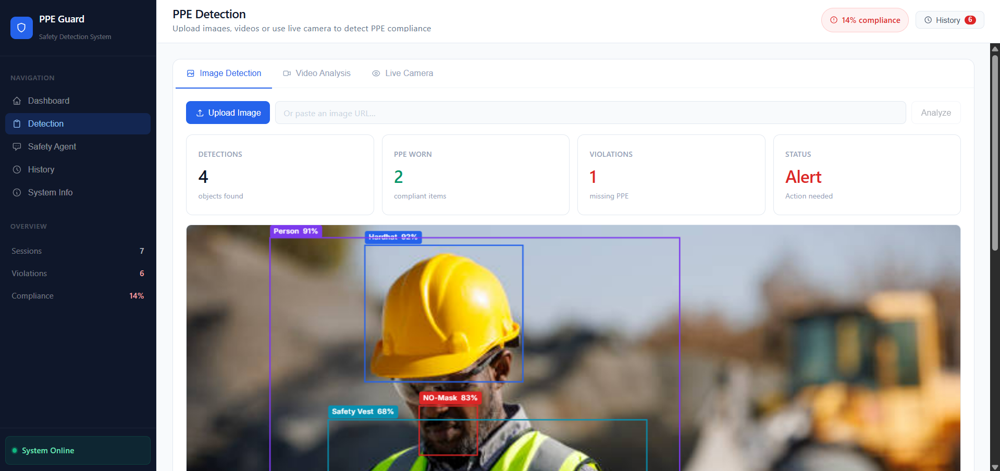
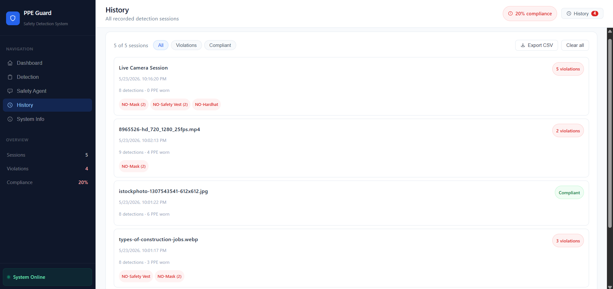
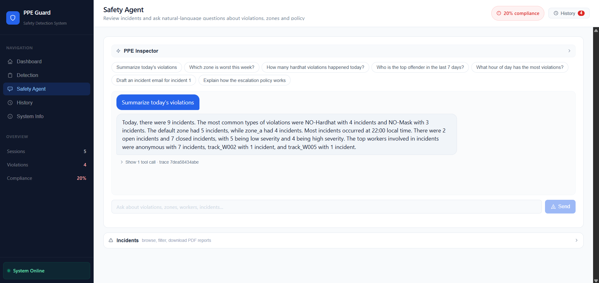
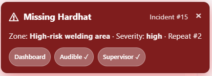
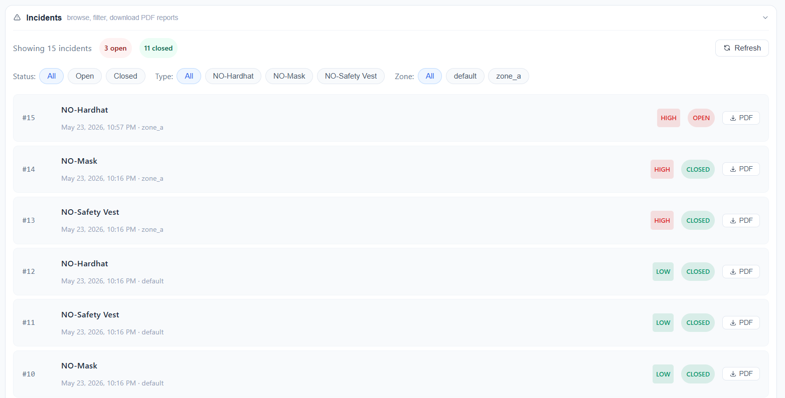
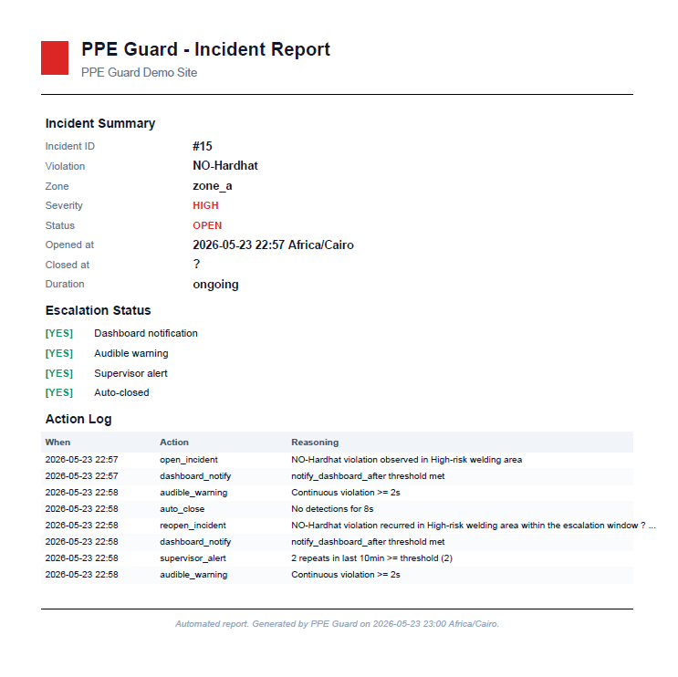
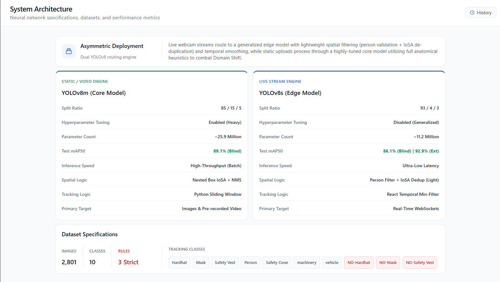
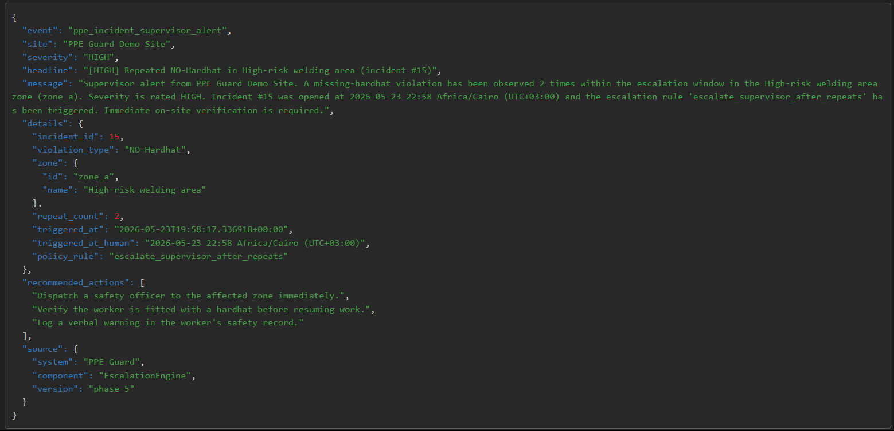

# 🏗️ PPE Guard — An Agentic System for Construction-Site Safety (YOLOv8)


[](https://opensource.org/licenses/MIT)

A real-time, web-based Deep Learning system that monitors safety compliance on construction sites — and **acts** on it. A custom-trained YOLOv8 detector (89.1% mAP) is deployed across a **dual-engine FastAPI backend** to detect Personal Protective Equipment (PPE) in images, video, and live webcam feeds. On top of detection sits an **autonomous safety-supervisor agent**: a policy-driven escalation engine, a fully-audited action trail, an LLM analytics assistant, and one-click PDF incident reports.

> **Perception + Agency** — the model *sees* the violation; the agent layer *decides what to do about it*. The agent is **additive**: it changes no trained weight and never blocks the detection path.

---

## 🌐 Interactive Web Application Features
A fully responsive React frontend for safety managers to monitor compliance in real-time:
* **Analytics Dashboard:** Aggregate statistics and per-class violation charts tracking total incidents and overall site safety.



* **Comprehensive Detection Hub:** Webcam streams or static image/video uploads, with instant visual feedback separating "Safe" compliance from "Alert" violations.





* **Session History:** A searchable, filterable log of all detection sessions (Compliant vs. Violation), with CSV export.



* **Safety Agent (PPE Inspector):** A chat assistant that answers natural-language questions about violations, zones, and policy by running SQL-backed tools over the incident database — and shows its work (every tool call is logged).



* **Live Escalation Overlay:** Real-time red incident banners and **audible spoken warnings** (browser Web Speech API) that persist across tabs, driven by the escalation engine.



* **Incidents Browser:** Browse, filter, and **download one-click PDF incident reports** (summary, timeline, and full audit trail).





## 🧠 System Architecture



The system is built in two cooperating layers.

### Perception Layer — Dual-Engine Detection
An **Asymmetric Deployment** routing engine balances latency and accuracy. Both models are loaded **once at startup** and inference runs in a separate thread pool, so the API never blocks.
* **Core Engine (Static / Video):** Powered by `YOLOv8m` (~25M params). Higher accuracy for image and video uploads that can afford the extra latency. Runs the **full custom post-processing** pipeline.
* **Edge Engine (Live Stream):** Powered by `YOLOv8s` (~11M params, ~80 ms/frame). A lightweight model served over **WebSockets** with 4-frame React temporal min-filtering for real-time webcam streams.

**Custom Post-Processing** — raw YOLO output isn't enough (a `NO-Hardhat` can fire on a yellow excavator), so detections pass through domain logic before becoming decisions:
* **Spatial PPE-to-person validation:** each PPE box must overlap a person *and* sit in the correct body zone (head for hardhat/mask, torso for vest). Floating detections require `conf > 0.75`.
* **IoU + IoSA NMS:** standard IoU plus **Intersection-over-Smaller-Area** catches nested duplicates (a small box inside a larger one) that plain IoU misses.
* **Mutual-exclusivity resolution:** `Hardhat` vs `NO-Hardhat` can't both win on one body region — the higher-confidence detection is kept.
* Thresholds are centralised in `config.py` (`CONF 0.50 · TRUST 0.75 · NMS-IoU 0.45 · nested-IoSA 0.70`).

### Agency Layer — Autonomous Safety Supervisor
An additive layer (under `backend/agent/`) that turns detections into accountable action. It never modifies the detection, NMS, or spatial-filtering code.

| Component | Role |
|-----------|------|
| **Policy-as-Code** (`policy.yaml`) | Zones, per-zone PPE rules, severity multipliers, and escalation timings — tunable without touching Python. |
| **Escalation State Machine** | **Deterministic** (not an LLM): `Detect → Open incident → Audible warning (2 s) → Notify supervisor (after repeats) → Auto-close (8 s silence)`. |
| **Persistence + Audit Trail** | SQLite store (SQLAlchemy). Every detection and every decision is logged via an `@audited` decorator — the system is not a black box. |
| **PPE Inspector Agent** | A function-calling LLM (Groq Llama-3.3-70B or Gemini, switchable in-app) with SQL-backed tools (`summarize_period`, `top_offenders`, `list/get_incident`, `draft_incident_email`, `query_violations`). |
| **Supervisor Webhook** | Posts a structured JSON alert to a configured endpoint when a violation persists past the repeat threshold. |
| **PDF Incident Reports** | One-click, **deterministically generated** (fpdf2) from the audited rows — summary, timeline, and action log. The LLM never writes the official report. |

> **Hybrid by design:** deterministic rules decide *when* to escalate; the LLM only writes human-facing language (chat answers, email drafts). Predictable, expressive, and auditable.

**Supervisor alert (webhook):** when a violation persists past the repeat threshold, a structured JSON alert is POSTed to the supervisor endpoint (shown here landing on a webhook inspector).



### Target Classes
Detects 10 classes across 3 roles:
* **Compliant:** `Hardhat`, `Mask`, `Safety Vest`
* **Violations:** `NO-Hardhat`, `NO-Mask`, `NO-Safety Vest`
* **Contextual:** `Person`, `Safety Cone`, `machinery`, `vehicle`

## 🚀 Quick Start Guide

### 1. Backend Setup (FastAPI)
Navigate to the backend directory, initialize a virtual environment, and install dependencies:

```bash
cd backend
python -m venv venv
venv\Scripts\activate
pip install -r requirements.txt
```

**Configure the agent (LLM) keys.** Copy the example env file and add your own key:

```bash
copy .env.example .env
```

Then edit `.env`:

```env
LLM_PROVIDER=groq
GROQ_API_KEY=your_groq_key_here          # free tier: https://console.groq.com
# GEMINI_API_KEY=your_gemini_key_here    # optional, if LLM_PROVIDER=gemini
```

> The SQLite database (`backend/agent/ppe_guard.db`) is created automatically on first run. To load demo incidents for the agent, optionally run `python -m agent.seed` (or `reset_and_reseed_demo.bat`).

**Run the Backend Server:**

```bash
fastapi dev main.py
```
*The API will be available at http://127.0.0.1:8000*

### 2. Frontend Setup (React)
Open a new terminal, navigate to the frontend directory, and install the Node modules:

```bash
cd frontend
npm install
```

**Run the Frontend Development Server:**

```bash
npm run dev
```
*The web application will launch at http://localhost:5173*

---

## 🛠️ Tech Stack
* **Model:** YOLOv8 (Ultralytics), custom-trained — 89.1% mAP @ IoU 0.5
* **Backend:** FastAPI, WebSockets, SQLAlchemy + SQLite, Pydantic
* **Agent:** Policy-as-code (YAML), deterministic state machine, Groq / Gemini LLM, fpdf2 reports
* **Frontend:** React 18, Vite, Canvas API, Web Speech API
